# NFS 3-TIER ARCHITECTURE

1. Spin up 4 EC2 Instances 
   - Storage : RHEL linux 8 (NFS Server)
   - 2 Webservers : RHEL linux 8
   - Database Server : Ubuntu 20.04 (MySQL Database)

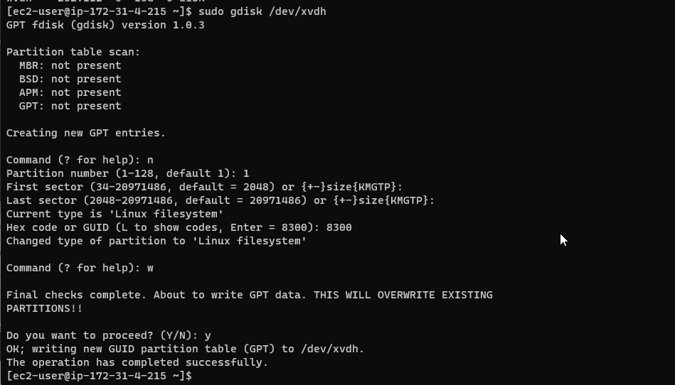

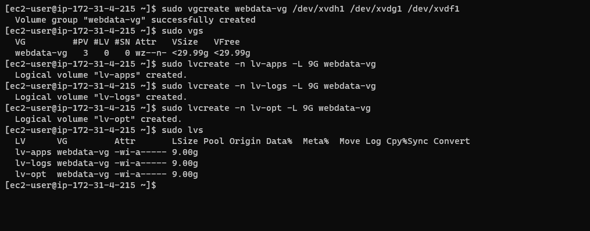

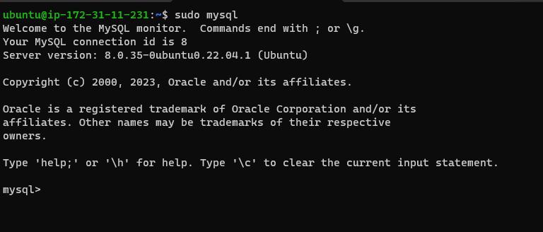

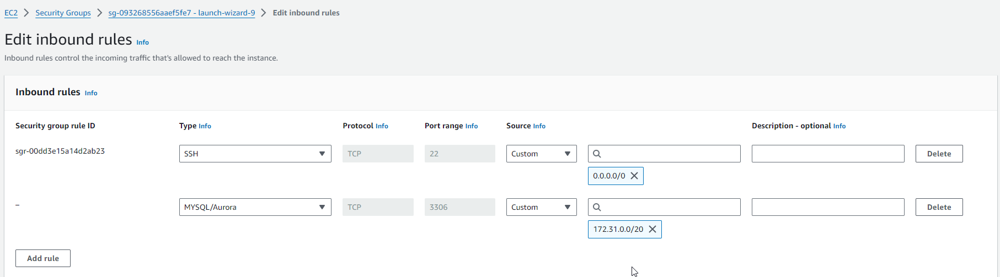

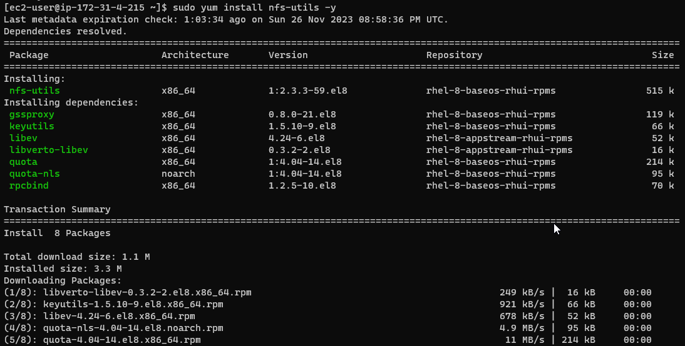

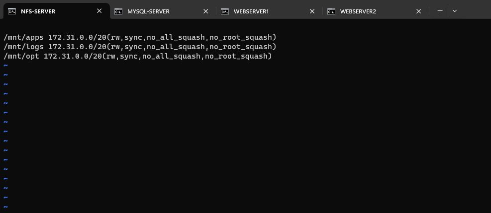

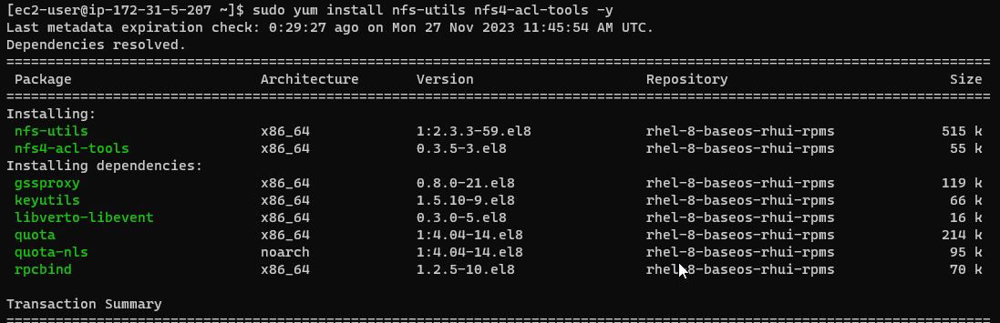

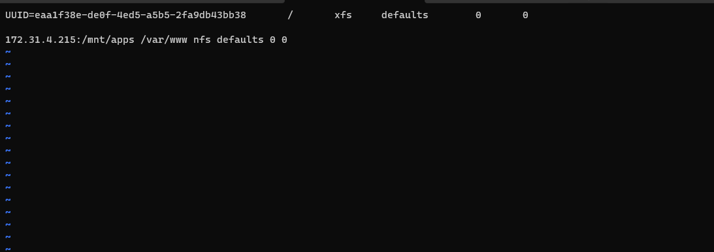

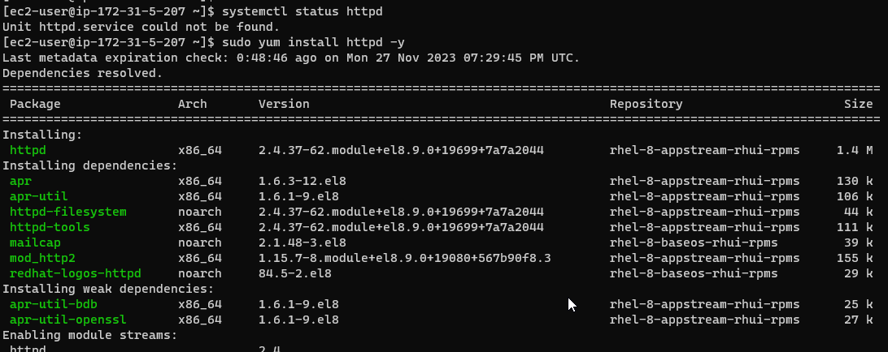

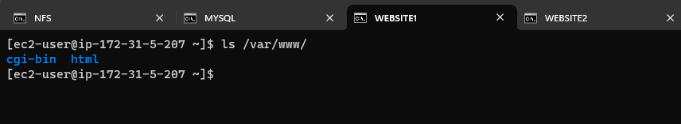

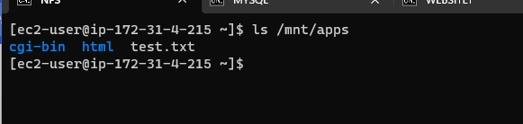

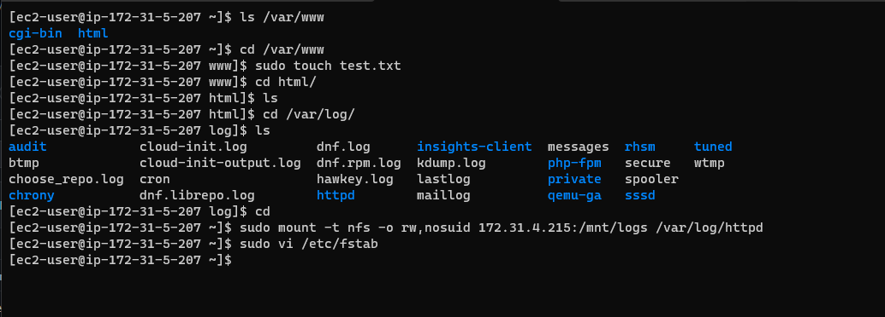

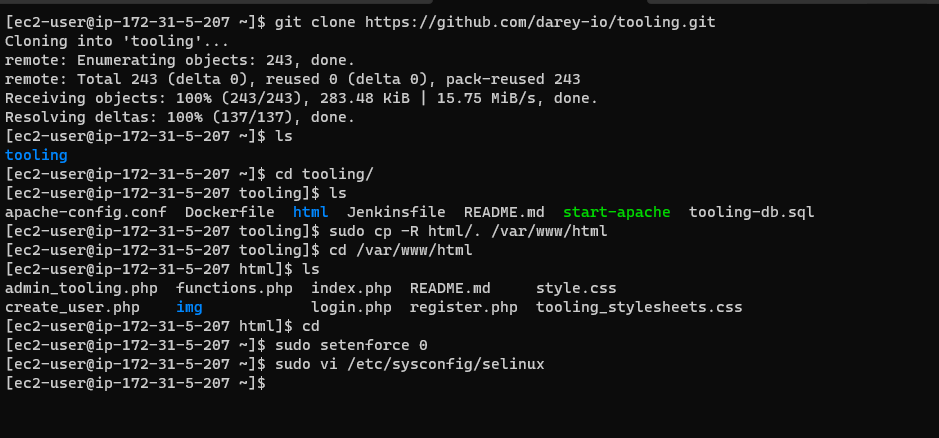

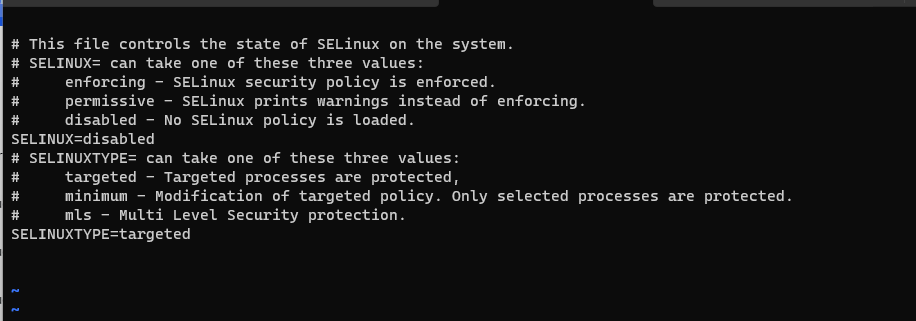

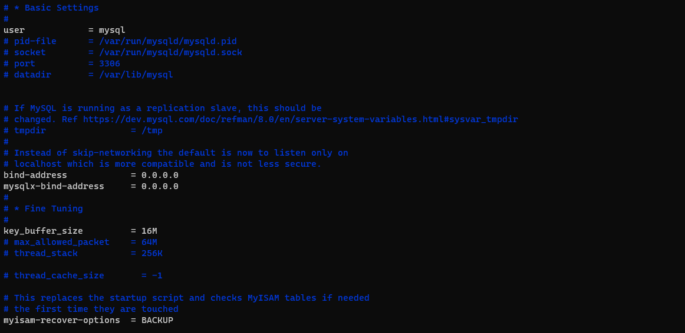

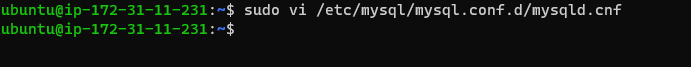

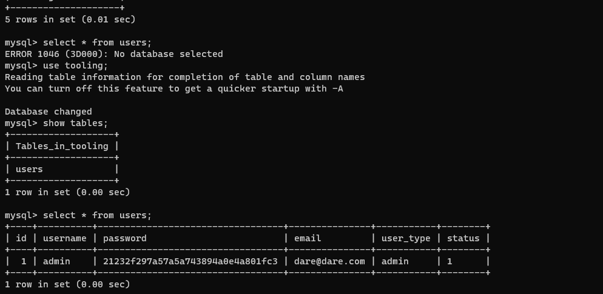

