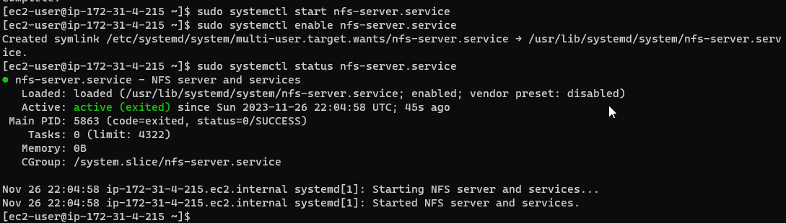

# NFS 3-TIER ARCHITECTURE


## Prepare NFS Server

1. Spin up 4 EC2 Instances 
   - Storage : RHEL linux 8 (NFS Server)
   - 2 Webservers : RHEL linux 8
   - Database Server : Ubuntu 20.04 (MySQL Database)


2. Create a 10 Gib Volume then attach it to the NFS Server


3. Create a partition on each of the 3 disks
   - sudo gdisk /dev/xvdf
   - sudo gdisk /dev/xvdg
   - sudo gdisk /dev/xvdh


4. Run `sudo yum install lvm2` to install the LMV2 package. 


5. Use `pvcreate` to mark each of the 3 disks as physical volumes to be used by LVM


6. Add all 3 PVs to a group called **web-data VG**
   - Run `sudo vgcreate webdata-vg /dev/xvh1 dev/xvdg1 /dev/xvdf1`
   
   **Create 3 Logical Volumes**
   - `sudo lvcreate -n lv-apps -L 9G webdata-vg`

   - `sudo lvcreate -n lv-logs -L 9G webdata-vg`
   
   - `sudo lvcreate -n lv-opt -L 9G webdata-vg`

   **Then Create mount points on `/mnt` directory for the logical volumes as follow:**

   - `sudo mkfs -t xfs /dev/webdata-vg/lv-apps`
   - `sudo mkfs -t xfs /dev/webdata-vg/lv-logs`
   - `sudo mkfs -t xfs /dev/webdata-vg/lv-opt`


7. Install the NFS server and configure it to strat on reboot and check that it is running.

  ```
  sudo yum -y update
  sudo yum install nfs-utils -y
  sudo systemctl strat nfs-server.service
  sudo systemctl enable nfs-server.service
  sudo systemctl status nfs-server.service
  
  ```





